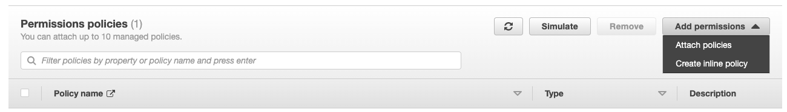

# Amplify Access Logs Shipper - Lambda

This is an AWS Lambda function that collects Amplify access logs and sends them to Logz.io in bulk over HTTP.

<div id="manual-lambda-configuration">

## Configuration with a Lambda function

<div class="tasklist">
  
#### 1. Create a new Lambda function

1. Open the AWS Lambda Console, and click **Create function**.
2. Choose **Author from scratch**.
3. In **Name**, add the log type to the name of the function.
4. In **Runtime**, choose **Python 3.9**.
5. Click **Create Function**.

After a few moments, you'll see configuration options for your Lambda function. You'll need this page later on, so keep it open.

#### 2. Zip the source files

Clone the CloudWatch Logs Shipper - Lambda project from GitHub to your computer,
and zip the Python files in the `src/` folder as follows:

```shell
git clone https://github.com/logzio/logzio_aws_serverless.git \
&& cd logzio_aws_serverless/python3/amplify/ \
&& mkdir -p dist/python3/shipper; cp -r ../shipper/shipper.py dist/python3/shipper \
&& cp src/lambda_function.py dist \
&& cd dist/ \
&& zip logzio-amplify lambda_function.py python3/shipper/*
```

#### 3. Upload the zip file and set environment variables

1. In the **Code source** section, select **Upload from > .zip file**.
2. Click **Upload**, and choose the zip file you created earlier (`logzio-amplify.zip`).
3. Click **Save**.
4. Navigate to **Configuration > Environment variables**.
5. Click **Edit**.
6. Click **Add environment variable**.
7. Fill in the **Key** and **Value** fields for each variable as per the table below:

| Parameter                                      | Description                                                                                                                                                                                                                                                                                                                                                 |
| ---------------------------------------------- | ----------------------------------------------------------------------------------------------------------------------------------------------------------------------------------------------------------------------------------------------------------------------------------------------------------------------------------------------------------- |
| TOKEN (Required)                               | The [token](https://app.logz.io/#/dashboard/settings/general) of the account you want to ship to.                                                                                                                                                                                                                                                           |
| LISTENER_URL (Required)                        | Determines protocol, listener host, and port. For example, `https://<<LISTENER-HOST>>:8071`. <br > Replace `<<LISTENER-HOST>>` with your region's listener host (for example, `https://listener.logz.io:8071`). For more information on finding your account's region, see [Account region](https://docs.logz.io/user-guide/accounts/account-region.html) . |
| AMPLIFY_DOMAIN (Required)                      | Amplify domain URL can find in amplify adming dashboard in section **General** inside **Production branch URL**                                                                                                                                                                                                                                             |
| TYPE (Default: `logzio_amplify_access_lambda`) | The log type you'll use with this Lambda. This can be a [type that supports default parsing](https://docs.logz.io/user-guide/log-shipping/built-in-log-types.html), or a custom log type. <br> You'll need to create a new Lambda for each log type you use.                                                                                                |
| AMPLIFY_APP_ID (Required)                      | You can find app id inside your amplify admin dashboard in section general isnide you App ARN field arn:aws:amplify:`REGION`:`AWS_ID`:apps/`APP_ID`                                                                                                                                                                                                         |
| TIMEOUT                                        | For trigger lambda function we define (in minutes) timeout to fetch Amplify logs for range time of TIMEOUT                                                                                                                                                                                                                                                  |

#### 4. Set the EventBridge (CloudWatch Events) trigger

1. Find the **Add triggers** list (left side of the Designer panel) and choose **EventBridge (CloudWatch Events)** from this list.
2. If you don't have pre defined schedule type(ex 1min) In the **Rule** click on create new rule.
3. **Rule name** enter a name to uniquely identify your rule.
4. **Rule description** (Optional) Provide an optional description for your rule.

5. **Rule type** choose Schedule expression that suppose to be equal to the TIMEOUT of enviroment variable (ex. rate(5 minutes))

#### 5. Update Permissions for Lambda Function

1. Go to **Configuration** in your Lamnda function find there tab **Permissions**
2. Click on A role name see in example **lambda-basic** it will redirect you to the IAM> Roles> lambda-basic
   

3. On a role page inside Permissions tabs you will see dropdown **Add permissions** and click on **Create inline policy** it will redirect you to Create Policy page
   

4. On Create Policy page you will see 2 tabs and you need to choose JSON tab
   

5. On A JSON tab please fill in JSON with your parameters

```
{
    "Version": "2012-10-17",
    "Statement": [
		{
            "Effect": "Allow",
            "Action": [
                "amplify:GenerateAccessLogs"
            ],
            "Resource": "arn:aws:amplify:AWS_REGION:XXX66029XXXX:apps/XXXXdn0mprXXXX/accesslogs/*"
        }
	]
}
```

AWS_REGION where your Amplify App is located(ex. us-west-2)
XXX66029XXXX with your AWS Account Id
XXXXdn0mprXXXX with the AWS Amplify App Id

#### 6. Check Logz.io for your logs

Give your logs some time to get from your system to ours, and then open [Kibana](https://app.logz.io/#/dashboard/kibana).

If you still don't see your logs, see [log shipping troubleshooting](https://docs.logz.io/user-guide/log-shipping/log-shipping-troubleshooting.html).

</div>

</div>
