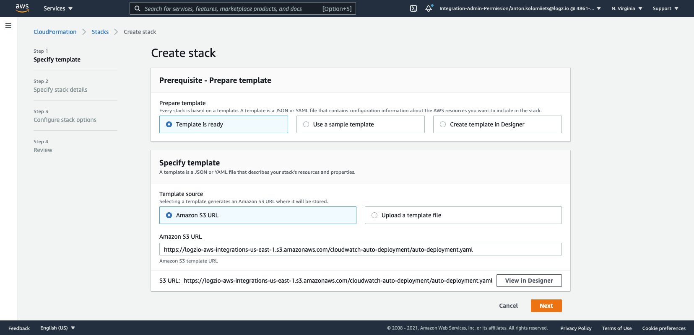
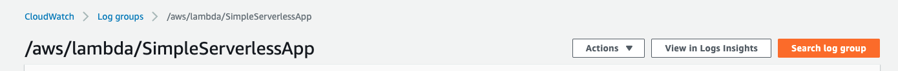
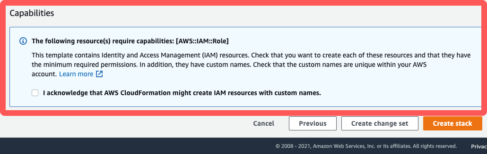

# CloudWatch Logs Shipper - Lambda

This is an AWS Lambda function that collects CloudWatch logs and sends them to Logz.io in bulk over HTTP.

-   Option 1: [Manual Lambda configuration](#manual-lambda-configuration)
-   Option 2: [Automated CloudFormation deployment](#automated-cloudformation-deployment)

<div id="manual-lambda-configuration">

## Manual configuration with a Lambda function

<div class="tasklist">
  
#### 1. Create a new Lambda function

1. Open the AWS Lambda Console, and click **Create function**.
2. Choose **Author from scratch**.
3. In **Name**, add the log type to the name of the function.
4. In **Runtime**, choose **Python 3.9**.
5. Click **Create Function**.

After a few moments, you'll see configuration options for your Lambda function. You'll need this page later on, so keep it open.

#### 2. Zip the source files

Clone the CloudWatch Logs Shipper - Lambda project from GitHub to your computer,
and zip the Python files in the `src/` folder as follows:

```shell
git clone https://github.com/logzio/logzio_aws_serverless.git \
&& cd logzio_aws_serverless/python3/cloudwatch/ \
&& mkdir -p dist/python3/shipper; cp -r ../shipper/shipper.py dist/python3/shipper \
&& cp src/lambda_function.py dist \
&& cd dist/ \
&& zip logzio-cloudwatch lambda_function.py python3/shipper/*
```

#### 3. Upload the zip file and set environment variables

1. In the **Code source** section, select **Upload from > .zip file**.
2. Click **Upload**, and choose the zip file you created earlier (`logzio-cloudwatch.zip`).
3. Click **Save**.
4. Navigate to **Configuration > Environment variables**.
5. Click **Edit**.
6. Click **Add environment variable**.
7. Fill in the **Key** and **Value** fields for each variable as per the table below:

| Parameter                                  | Description                                                                                                                                                                                                                                                                                                                                    |
| ------------------------------------------ | ---------------------------------------------------------------------------------------------------------------------------------------------------------------------------------------------------------------------------------------------------------------------------------------------------------------------------------------------- |
| TOKEN (Required)                           | The [token](https://app.logz.io/#/dashboard/settings/general) of the account you want to ship to.                                                                                                                                                                                                                                              |
| LISTENER_URL (Required)                    | Determines protocol, listener host, and port. For example, `https://<<LISTENER-HOST>>:8071`. <br > Replace `<<LISTENER-HOST>>` with your region's listener host (for example, `listener.logz.io`). For more information on finding your account's region, see [Account region](https://docs.logz.io/user-guide/accounts/account-region.html) . |
| TYPE (Default: `logzio_cloudwatch_lambda`) | The log type you'll use with this Lambda. This can be a [type that supports default parsing](https://docs.logz.io/user-guide/log-shipping/built-in-log-types.html), or a custom log type. <br> You'll need to create a new Lambda for each log type you use.                                                                                   |
| FORMAT (Default: `text`)                   | `json` or `text`. If `json`, the Lambda function will attempt to parse the message field as JSON and populate the event data with the parsed fields.                                                                                                                                                                                           |
| COMPRESS (Default: `false`)                | Set to `true` to compress logs before sending them. Set to `false` to send uncompressed logs.                                                                                                                                                                                                                                                  |
| SENDALL (Default: `false`)                 | By default, we do not send logs of type START, END, REPORT. Change to `true` to send all log data                                                                                                                                                                                                                                              |
| ENRICH                                     | Enrich CloudWatch events with custom properties, formatted as `key1=value1;key2=value2`.                                                                                                                                                                                                                                                       |

#### 4. Set the CloudWatch Logs event trigger

1. Find the **Add triggers** list (left side of the Designer panel) and choose **CloudWatch Logs** from this list.
2. In the **Log group** field, select the applicable log group.
3. Type a **Filter name** (required) and **Filter pattern** (optional).
4. Click **Add**, and then click **Save** at the top of the page.

#### 6. Check Logz.io for your logs

Give your logs some time to get from your system to ours, and then open [Kibana](https://app.logz.io/#/dashboard/kibana).

If you still don't see your logs, see [log shipping troubleshooting](https://docs.logz.io/user-guide/log-shipping/log-shipping-troubleshooting.html).

</div>

</div>
<!-- tab:end -->

<!-- tab:start -->
<div id="automated-cloudformation-deployment">

## Automated CloudFormation deployment

This is an AWS Lambda function that subscribes to the CloudWatch log groups and sends them to Logz.io in bulk, over HTTP.

<div class="tasklist">

#### 1. Start the automated deployment

To start just press the button and follow the instructions:

| REGION           | DEPLOYMENT                                                                                                                                                                                                                                                                                                                                                          |
| ---------------- | ------------------------------------------------------------------------------------------------------------------------------------------------------------------------------------------------------------------------------------------------------------------------------------------------------------------------------------------------------------------- |
| `us-east-1`      | [](https://console.aws.amazon.com/cloudformation/home?region=us-east-1#/stacks/create/template?templateURL=https://logzio-aws-integrations-us-east-1.s3.amazonaws.com/cloudwatch-auto-deployment/0.0.3/auto-deployment.yaml&stackName=logzio-cloudwatch-shipper)           |
| `us-east-2`      | [](https://console.aws.amazon.com/cloudformation/home?region=us-east-2#/stacks/create/template?templateURL=https://logzio-aws-integrations-us-east-2.s3.amazonaws.com/cloudwatch-auto-deployment/0.0.3/auto-deployment.yaml&stackName=logzio-cloudwatch-shipper)           |
| `us-west-1`      | [](https://console.aws.amazon.com/cloudformation/home?region=eu-west-1#/stacks/create/template?templateURL=https://logzio-aws-integrations-us-west-1.s3.amazonaws.com/cloudwatch-auto-deployment/0.0.3/auto-deployment.yaml&stackName=logzio-cloudwatch-shipper)           |
| `us-west-2`      | [](https://console.aws.amazon.com/cloudformation/home?region=eu-west-2#/stacks/create/template?templateURL=https://logzio-aws-integrations-us-west-2.s3.amazonaws.com/cloudwatch-auto-deployment/0.0.3/auto-deployment.yaml&stackName=logzio-cloudwatch-shipper)           |
| `eu-central-1`   | [](https://console.aws.amazon.com/cloudformation/home?region=eu-central-1#/stacks/create/template?templateURL=https://logzio-aws-integrations-eu-central-1.s3.amazonaws.com/cloudwatch-auto-deployment/0.0.3/auto-deployment.yaml&stackName=logzio-cloudwatch-shipper)     |
| `eu-north-1`     | [](https://console.aws.amazon.com/cloudformation/home?region=eu-north-1#/stacks/create/template?templateURL=https://logzio-aws-integrations-eu-north-1.s3.amazonaws.com/cloudwatch-auto-deployment/0.0.3/auto-deployment.yaml&stackName=logzio-cloudwatch-shipper)         |
| `eu-west-1`      | [](https://console.aws.amazon.com/cloudformation/home?region=eu-west-1#/stacks/create/template?templateURL=https://logzio-aws-integrations-eu-west-1.s3.amazonaws.com/cloudwatch-auto-deployment/0.0.3/auto-deployment.yaml&stackName=logzio-cloudwatch-shipper)           |
| `eu-west-2`      | [](https://console.aws.amazon.com/cloudformation/home?region=eu-west-2#/stacks/create/template?templateURL=https://logzio-aws-integrations-eu-west-2.s3.amazonaws.com/cloudwatch-auto-deployment/0.0.3/auto-deployment.yaml&stackName=logzio-cloudwatch-shipper)           |
| `eu-west-3`      | [](https://console.aws.amazon.com/cloudformation/home?region=eu-west-3#/stacks/create/template?templateURL=https://logzio-aws-integrations-eu-west-3.s3.amazonaws.com/cloudwatch-auto-deployment/0.0.3/auto-deployment.yaml&stackName=logzio-cloudwatch-shipper)           |
| `sa-east-1`      | [](https://console.aws.amazon.com/cloudformation/home?region=sa-east-1#/stacks/create/template?templateURL=https://logzio-aws-integrations-sa-east-1.s3.amazonaws.com/cloudwatch-auto-deployment/0.0.3/auto-deployment.yaml&stackName=logzio-cloudwatch-shipper)           |
| `ca-central-1`   | [](https://console.aws.amazon.com/cloudformation/home?region=ca-central-1#/stacks/create/template?templateURL=https://logzio-aws-integrations-ca-central-1.s3.amazonaws.com/cloudwatch-auto-deployment/0.0.3/auto-deployment.yaml&stackName=logzio-cloudwatch-shipper)     |
| `ap-northeast-1` | [](https://console.aws.amazon.com/cloudformation/home?region=ap-northeast-1#/stacks/create/template?templateURL=https://logzio-aws-integrations-ap-northeast-1.s3.amazonaws.com/cloudwatch-auto-deployment/0.0.3/auto-deployment.yaml&stackName=logzio-cloudwatch-shipper) |
| `ap-northeast-2` | [](https://console.aws.amazon.com/cloudformation/home?region=ap-northeast-2#/stacks/create/template?templateURL=https://logzio-aws-integrations-ap-northeast-2.s3.amazonaws.com/cloudwatch-auto-deployment/0.0.3/auto-deployment.yaml&stackName=logzio-cloudwatch-shipper) |
| `ap-northeast-3` | [](https://console.aws.amazon.com/cloudformation/home?region=ap-northeast-3#/stacks/create/template?templateURL=https://logzio-aws-integrations-ap-northeast-3.s3.amazonaws.com/cloudwatch-auto-deployment/0.0.3/auto-deployment.yaml&stackName=logzio-cloudwatch-shipper) |
| `ap-south-1`     | [](https://console.aws.amazon.com/cloudformation/home?region=ap-south-1#/stacks/create/template?templateURL=https://logzio-aws-integrations-ap-south-1.s3.amazonaws.com/cloudwatch-auto-deployment/0.0.3/auto-deployment.yaml&stackName=logzio-cloudwatch-shipper)         |
| `ap-southeast-1` | [](https://console.aws.amazon.com/cloudformation/home?region=ap-southeast-1#/stacks/create/template?templateURL=https://logzio-aws-integrations-ap-southeast-1.s3.amazonaws.com/cloudwatch-auto-deployment/0.0.3/auto-deployment.yaml&stackName=logzio-cloudwatch-shipper) |
| `ap-southeast-2` | [](https://console.aws.amazon.com/cloudformation/home?region=ap-southeast-2#/stacks/create/template?templateURL=https://logzio-aws-integrations-ap-southeast-2.s3.amazonaws.com/cloudwatch-auto-deployment/0.0.3/auto-deployment.yaml&stackName=logzio-cloudwatch-shipper) |

You'll be taken to AWS, where you need to configure the resources to be deployed. Keep the defaults and click Next:



#### 2. Fill in the stack parameters


In the **Specify stack details** screen, specify the parameters as per the table below:

| Parameter                                      | Description                                                                                                                                                                                                                             |
| ---------------------------------------------- | --------------------------------------------------------------------------------------------------------------------------------------------------------------------------------------------------------------------------------------- |
| LogzioToken (Required)                         | Replace `<<SHIPPING-TOKEN>>` with the [token](https://app.logz.io/#/dashboard/settings/general) of the account you want to ship to.                                                                                                     |
| LogGroup\*                                     | CloudWatch Log Group name from where you want to send logs.                                                                                                                                                                             |
| LogzioListenerUrl                              | Listener host, and port (for example, `https://<<LISTENER-HOST>>:8071`).                                                                                                                                                                |
| LogzioType (Default: `logzio_cloudwatch_logs`) | The log type you'll use with this Lambda. This can be a [built-in log type](https://docs.logz.io/user-guide/log-shipping/built-in-log-types.html), or a custom log type. <br> You should create a new Lambda for each log type you use. |
| LogzioFormat (Default: `text`)                 | `json` or `text`. If `json`, the Lambda function will attempt to parse the message field as JSON and populate the event data with the parsed fields.                                                                                    |
| LogzioSendAll (Default: `false`)               | By default, we do not send logs of type START, END, REPORT. Change to `true` to send all log data                                                                                                                                       |
| LogzioCompress (Default: `false`)              | Set to `true` to compress logs before sending them. Set to `false` to send uncompressed logs.                                                                                                                                           |
| LogzioEnrich                                   | Enrich CloudWatch events with custom properties, formatted as `key1=value1;key2=value2`.                                                                                                                                                |

**Note:** You can find \*LogGroup in the title of the CloudWatch page for the log group that you want to export to Logz.io as shown below:


When all the parameters have been assigned, click **Next**.

#### 3. Define tags

In the **Configure stack options** screen, assign tags to this function to easily identify your resources and click **Next**.


#### 4. Confirm and create the stack.

In the final screen, AWS will automatically show a notice requesting you to acknowledge that AWS CloudFormation might create IAM resources. Check the box and click **Create Stack**.



#### 5. Check Logz.io for your logs

Give your logs some time to get from your system to ours, and then open [Kibana](https://app.logz.io/#/dashboard/kibana).

If you still don't see your logs, see [log shipping troubleshooting](https://docs.logz.io/user-guide/log-shipping/log-shipping-troubleshooting.html).

</div>
<!-- tab:end -->

</div>
<!-- tabContainer:end -->
